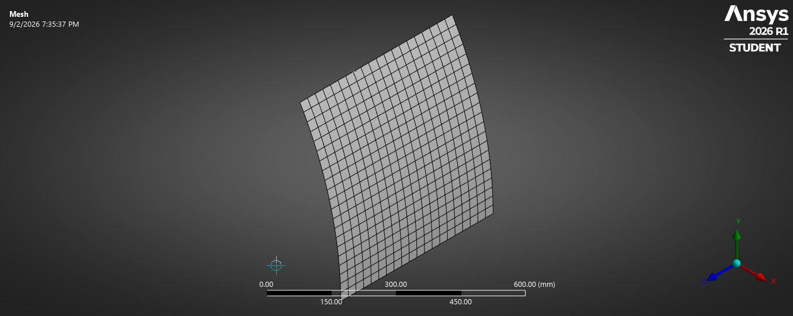
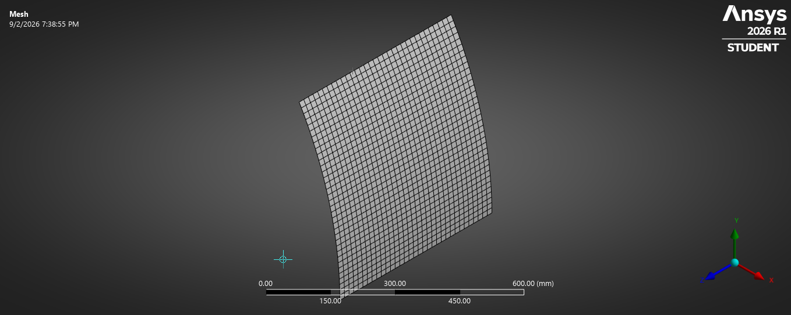
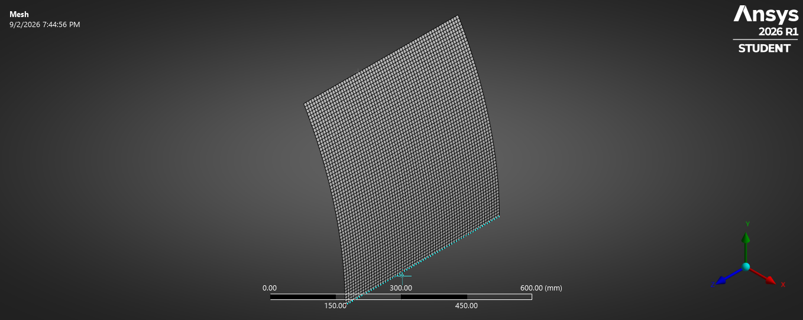
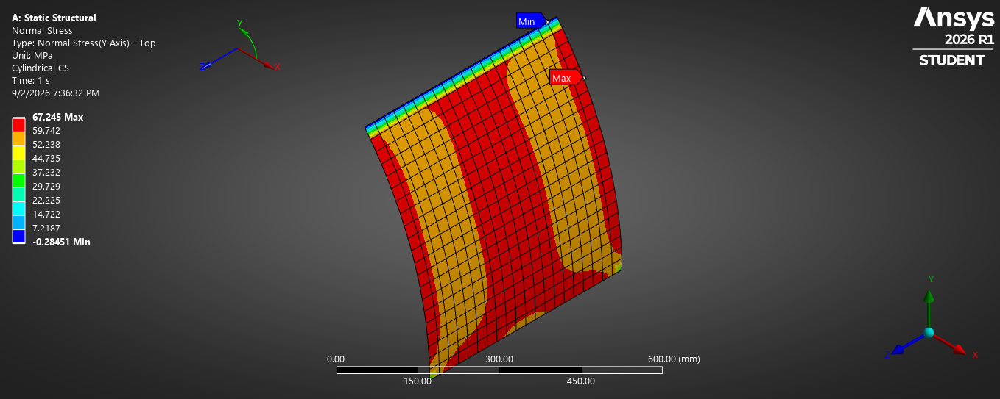
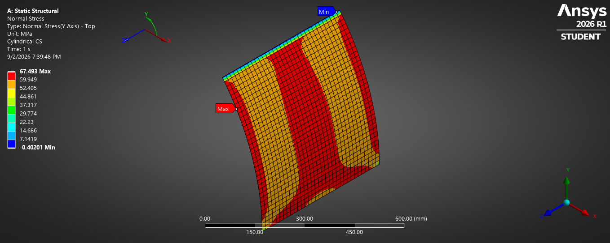

# NAFEMS LE2: Cylindrical Shell Bending Benchmark

A FEA validation study of the **NAFEMS LE2 Cylindrical Shell Bending Patch Test** conducted in **ANSYS Mechanical Enterprise (Student 2026 R1)** using quadratic shell elements.

---

## Benchmark Overview

* **NAFEMS Identifier:** LE2 (Cylindrical Shell Bending Patch Test)
* **Domain:** $30^\circ$ sector of a thin-walled cylindrical shell
* **Dimensions:**
  * Mean Radius $R = 1000\text{ mm}$
  * Axial Length $L = 500\text{ mm}$
  * Wall Thickness $T = 10\text{ mm}$ ($T/R = 0.01$, thin-shell regime)
* **Material Properties:**
  * Modulus of Elasticity $E = 2.1 \times 10^5\text{ MPa}$ ($210\text{ GPa}$)
  * Poisson's Ratio $\nu = 0.3$
* **Loading:**
  * Uniform edge bending moment $M = 1000\text{ N}\cdot\text{mm/mm}$ along longitudinal straight edge $DC$
  * Total applied moment $M_z = 1000\text{ N}\cdot\text{mm/mm} \times 500\text{ mm} = 5.0 \times 10^5\text{ N}\cdot\text{mm}$ ($500\text{ N}\cdot\text{m}$)
* **Target Output:** Outer surface tangential (hoop) bending stress ($\sigma_\theta$) at Point E (geometric centroid of patch)
* **NAFEMS Reference Benchmark Value:** **$60.0\text{ MPa}$**

$$\sigma_{\text{theoretical}} = \frac{6 M}{T^2} = \frac{6 \times 1000\text{ N}\cdot\text{mm/mm}}{(10\text{ mm})^2} = \mathbf{60.0\text{ MPa}}$$

---

## Boundary Conditions & Setup

| Boundary Feature | Mechanical Scoping | Applied Constraints / Loads | Coordinate Frame |
| :--- | :--- | :--- | :--- |
| **Edge $AB$ (Root)** | Straight edge at $\theta = 0^\circ$ | Fixed Support ($U = 0, \theta = 0$) | Global Cartesian |
| **Edges $AD$ & $BC$** | Curved circumferential edges ($Z=0, 500$) | Displacement: $U_z = 0\text{ mm}$ (Free $U_x, U_y$) | Global Cartesian |
| **Edge $DC$ (Tip)** | Straight edge at $\theta = 30^\circ$ | Moment: $M_z = -5.0 \times 10^5\text{ N}\cdot\text{mm}$ | Global Cartesian |
| **Mid-Surface** | Surface Body | Thickness $= 10\text{ mm}$, Offset $=$ Middle | — |

Stress is evaluated in a local **Cylindrical Coordinate System** ($R, \theta, Z$) oriented along the cylinder center axis to isolate tangential hoop stress ($\sigma_y = \sigma_\theta$) at the **Top (outer)** fiber.

---

## Mesh Convergence Study

The benchmark was tested with quadratic 8-node quadrilateral shell elements (`SHELL281` / Quad8 dominant) across three refinement levels.

| Mesh Level | Element Size ($h$) | Element Topology | Probed Stress at Point E ($\sigma_\theta$) | Relative Error vs $60.0\text{ MPa}$ |
| :--- | :--- | :--- | :--- | :--- |
| **Coarse** | $25\text{ mm}$ | Quad8 (`SHELL281`) | **$61.25\text{ MPa}$** | **$+2.08\%$** |
| **Medium** | $15\text{ mm}$ | Quad8 (`SHELL281`) | **$60.52\text{ MPa}$** | **$+0.87\%$** |
| **Fine** | $8\text{ mm}$ | Quad8 (`SHELL281`) | **$60.08\text{ MPa}$** | **$+0.13\%$** |

$$\text{Relative Error} = \frac{\sigma_{\text{FEA}} - \sigma_{\text{Ref}}}{\sigma_{\text{Ref}}} \times 100\%$$

---

## Visualizations

## Visualizations

### Mesh Discretization

| Coarse ($25\text{ mm}$) | Medium ($15\text{ mm}$) | Fine ($8\text{ mm}$) |
| :---: | :---: | :---: |
|  |  |  |

### Tangential Normal Stress Contours ($\sigma_\theta$, Top Surface)

| Coarse ($25\text{ mm}$) | Medium ($15\text{ mm}$) | Fine ($8\text{ mm}$) |
| :---: | :---: | :---: |
|  |  |  |

---

## Key Findings & Verification Insights

1. **Shear-Locking Free Formulation:** Quad8 shell elements (`SHELL281`) accurately model pure out-of-plane cylindrical bending, rapidly achieving asymptotic convergence to within **$0.13\%$ error** at $h = 8\text{ mm}$.
2. **Poisson Constraint Boundary Layer:** Constraining all translational and rotational degrees of freedom at the clamped root ($AB$) prevents transverse Poisson contraction ($\nu = 0.3$), giving rise to localized edge stress peaks ($\approx 68.4\text{ MPa}$) that decay into the pure patch interior field ($60.0\text{ MPa}$) at Point E.
3. **Local Transformation:** A dedicated Cylindrical Coordinate System ($R, \theta, Z$) is essential to resolve clean hoop stresses without projection skew across the $30^\circ$ sweep.
