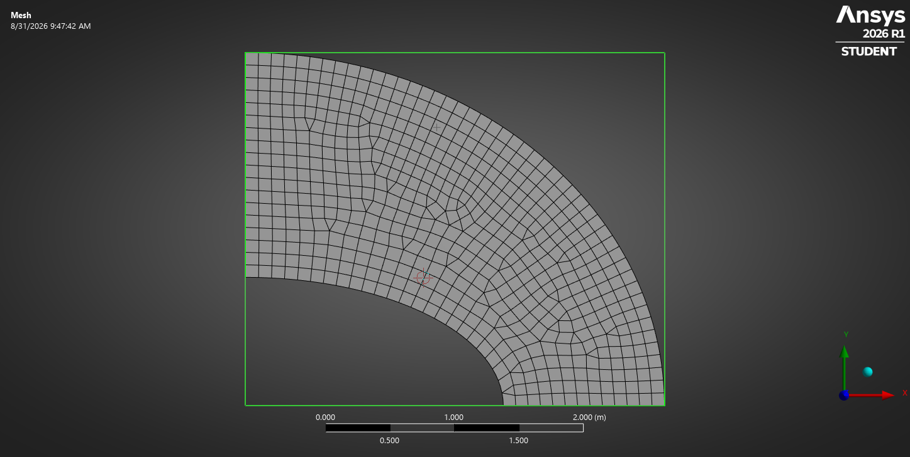
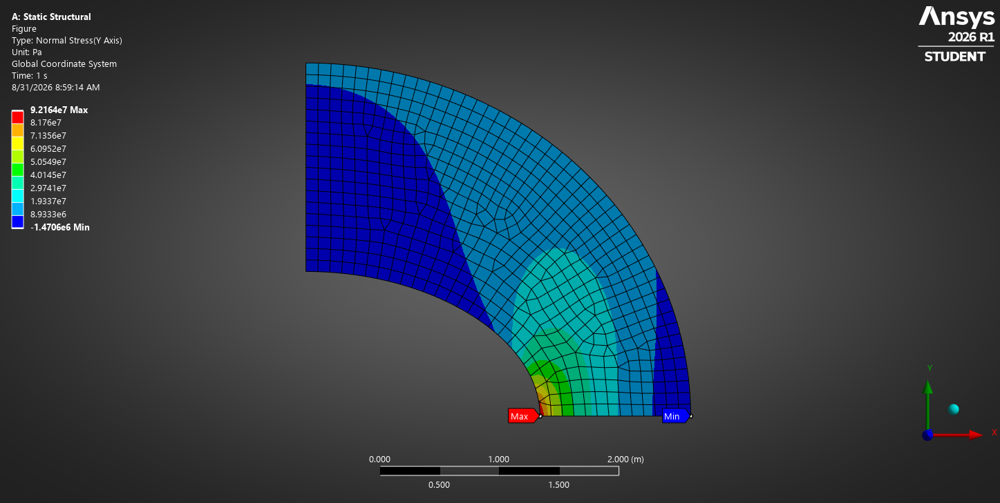
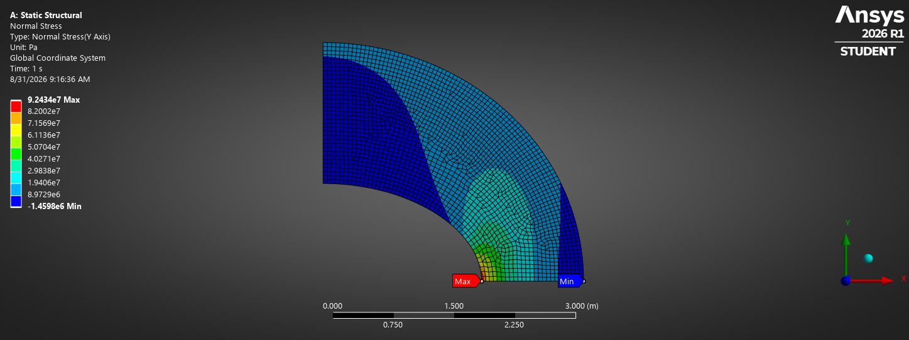
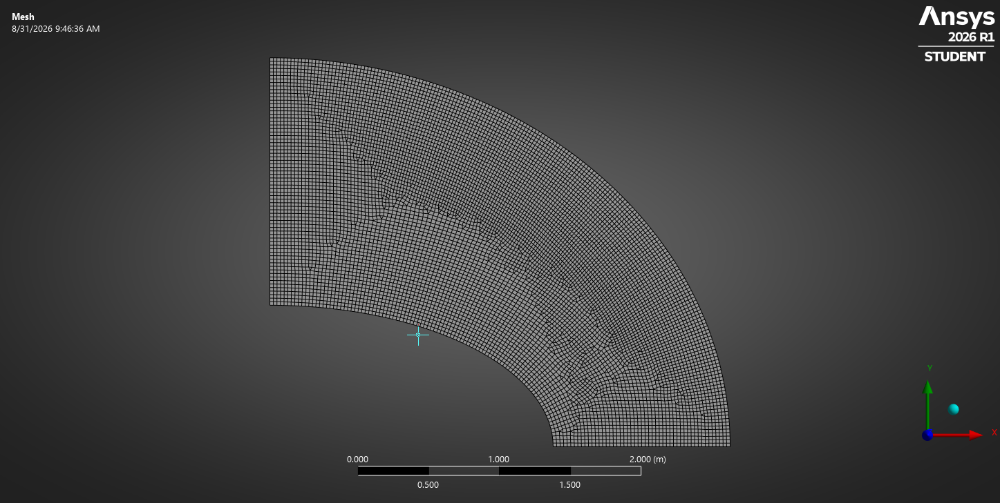
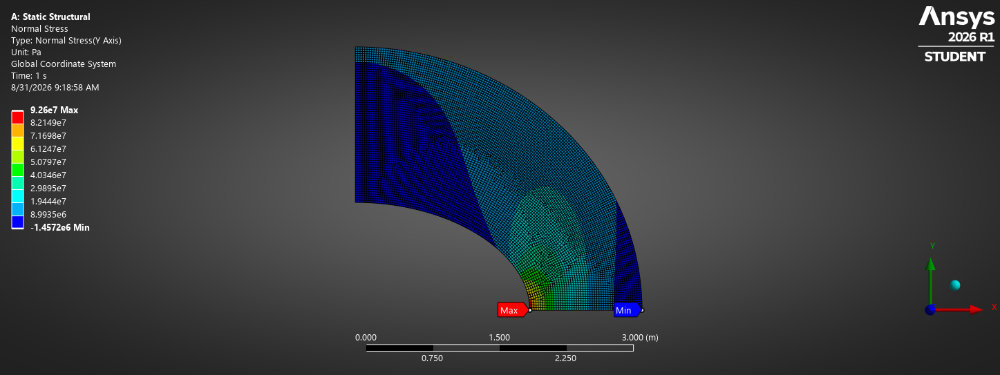
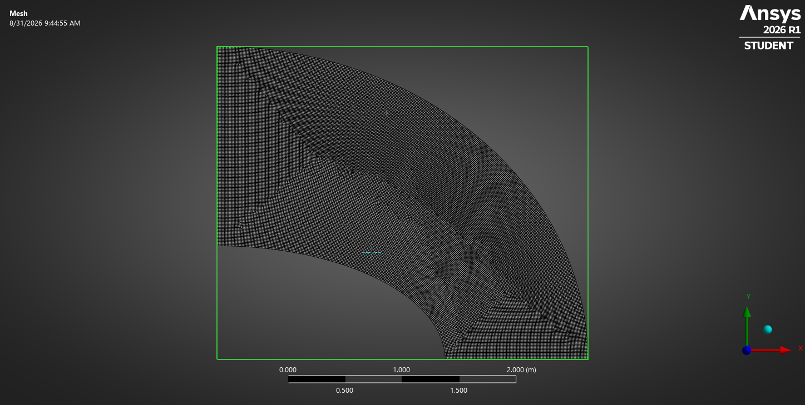
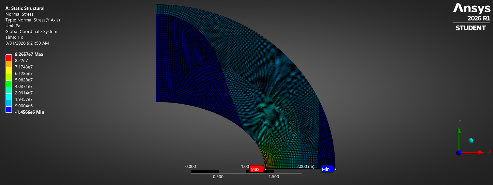

# NAFEMS LE1: Plane Stress - Elliptic Membrane Benchmark

## 1. Problem Overview
- **Benchmark Code:** NAFEMS LE1 (Linear Elastic Test)
- **Objective:** Determine the tangential edge normal stress ($\sigma_y$) at Point D under uniform outward tension.
- **Reference Benchmark Solution:** $\sigma_y = \mathbf{92.7\text{ MPa}}$ at Point D $(X=2.0\text{ m}, Y=0\text{ m})$.

## 2. Model & Mathematical Idealization
- **Geometry:** Quarter-symmetry elliptic ring bounded by:
  - Inner ellipse: $(x/2)^2 + y^2 = 1$
  - Outer ellipse: $(x/3.25)^2 + (y/2.75)^2 = 1$
  - Thickness: $T = 0.1\text{ m}$
- **Formulation:** 2D Plane Stress ($\sigma_z = 0, \tau_{xz} = \tau_{yz} = 0$).
- **Material Properties:** 
  - Young's Modulus ($E$): $210\text{ GPa}$
  - Poisson's Ratio ($\nu$): $0.3$

## 3. Boundary Conditions & Loads
- **Edge DC ($Y=0$):** Displacement $U_y = 0$ (Symmetry condition across X-axis).
- **Edge AB ($X=0$):** Displacement $U_x = 0$ (Symmetry condition across Y-axis).
- **Edge BC (Outer Ellipse):** Uniform outward normal pressure $P = -10\text{ MPa}$ (Tension).

## 4. Element Selection & Meshing Strategy
- **Element Topology:** 2D 8-Node Quadratic Quadrilateral Elements (`PLANE183` in ANSYS Mechanical).
- **Why Quads?** Quadratic quads provide higher-order orthogonal shape functions that capture steep tangential stress gradients along curved contours without artificial shear locking.

## 5. Mesh Convergence Study ($h$-Refinement)

| Element Size ($h$) | Element Formulation | Normal Stress $\sigma_y$ (MPa) | Error vs. NAFEMS (92.7 MPa) |
| :--- | :--- | :--- | :--- |
| $0.1000\text{ m}$ | Quad-Dominant (8-node) | $92.164\text{ MPa}$ | $-0.58\%$ |
| $0.05\text{ m}$ | Quad-Dominant (8-node) | $92.434\text{ MPa}$ | $\mathbf{-0.286\%}$ |
| $0.025\text{ m}$ | Quad-Dominant (8-node) | $92.6\text{ MPa}$ | $\mathbf{-0.107\%}$ |
| $0.0125\text{ m}$ | Quad-Dominant (8-node) | $92.657\text{ MPa}$ | $\mathbf{-0.046\%}$ |

## 6. Results & Visual Verification

| Element Size ($h$) | Discretized Mesh | Normal Stress ($\sigma_y$) Contour |
| :---: | :---: | :---: |
| **$0.1000\text{ m}$** |  |  |
| **$0.0500\text{ m}$** |  |  |
| **$0.0250\text{ m}$** |  |  |
| **$0.0125\text{ m}$** |  |  |

### Convergence Evidence
- The solution demonstrates asymptotic numerical convergence with $< 0.05\%$ relative discretization error, confirming mathematical independence from the mesh.

## 7. Key Takeaways & Verification Verdict
- Successfully validated against standard NAFEMS benchmark results.
- Demonstrated strict quarter-symmetry boundary application in 2D Space.
- Verified that $h$-refinement resolves initial displacement-based FE stiffness.
